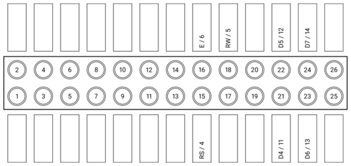

Getting Started
###############

After you've :doc:`installed <installation>` RPLCD, you need two more steps to
get started: Correct wiring and importing the library.

Wiring
======

Via I²C
~~~~~~~

The wiring is much simpler if you have a LCD module with I²C support. These
boards usually have a "backpack board" and look similar to this:

First, connect the pins on the right with the Raspberry Pi:

- GND: Pin 6 (GND)
- VCC: Pin 2 (5V)
- SDA: Pin 5 (SDA)
- SCL: Pin 3 (SCL)

To make things clearer, here's a little visualization:

.. image:: _static/wiring-i2c.png
    :alt: LCD wiring (I²C)

Also, make sure that the jumper on the two pins on the left is attached,
otherwise the backlight won't work.

Via GPIO
~~~~~~~~

If you don't have an I²C version of the board, you can also connect the LCD
Pins directly to the GPIO header of the Raspberry Pi.

The standard wiring configuration uses the following pins in 4 bit mode (BOARD
numbering scheme):

- RS: 15
- RW: 18
- E: 16
- Data 4-7: 21, 22, 23, 24

To make things clearer, here's a little visualization:

After wiring up the data pins, you have to connect the voltage input for
controller and backlight, and set up the contrast circuit. As there are some
differences regarding the hardware between different modules, please refer to
the `Adafruit tutorial
<https://learn.adafruit.com/character-lcds/wiring-a-character-lcd>`_ to learn
how to wire up these circuits.

Sending Simple Text to LCD
==========================

Setup: I²C
~~~~~~~~~~

First, import the RPLCD library from your Python script.

.. sourcecode:: python

    from RPLCD.i2c import CharLCD

Then create a new instance of the :class:`~RPLCD.i2c.CharLCD` class. For that,
you need to know the address of your LCD. You can find it on the command line
using the ``i2cdetect 1`` command. In my case the address of the display was
``0x27``:

.. sourcecode:: python

    lcd = CharLCD(0x27)

If you want to customize the way the LCD is instantiated (e.g. by changing the
number of columns and rows on your display or the I²C port), you can change the
corresponding parameters. All of them are optional.

.. sourcecode:: python

    lcd = CharLCD(address=0x27, port=1, cols=20, rows=4, dotsize=8, backlight_enabled=True)

Setup: GPIO
~~~~~~~~~~~

First, import the RPLCD library from your Python script.

.. sourcecode:: python

    from RPLCD.i2c import CharLCD

Then create a new instance of the :class:`~RPLCD.i2c.CharLCD` class. If you used
the default wiring above and have a 20x4 LCD, all that you need is the
following:

.. sourcecode:: python

    lcd = CharLCD()

If you want to customize the way the LCD is instantiated (e.g. by changing the
pin configuration or the number of columns and rows on your display), you can
change the corresponding parameters. All of them are optional.

.. sourcecode:: python

    from RPi import GPIO

    lcd = CharLCD(pin_rs=15, pin_rw=18, pin_e=16, pins_data=[21, 22, 23, 24],
                  numbering_mode=GPIO.BOARD,
                  cols=20, rows=4, dotsize=8,
                  auto_linebreaks=True)

Writing Data
~~~~~~~~~~~~

Now you can write a string to the LCD:

.. sourcecode:: python

    lcd.write_string(u'Hello world')

To clean the display, use the ``clear()`` method:

.. sourcecode:: python

    lcd.clear()

You can control line breaks with the newline (``\n``, moves down 1 line) and
carriage return (``\r``, moves to beginning of line) characters.

.. sourcecode:: python

    lcd.write_string(u'Hello\r\n  World!')

And you can also set the cursor position directly:

.. sourcecode:: python

    lcd.cursor_pos = (2, 0)
