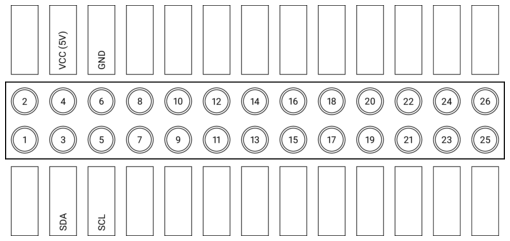

.. _getting-started:

Getting Started
###############

After you've :doc:`installed <installation>` RPLCD, you need two more steps to
get started: Correct wiring and importing the library.

Wiring
======

Via I²C
~~~~~~~

The wiring is much simpler if you have a LCD module with I²C support. These
boards usually have a "backpack board" and look similar to this:

.. image:: _static/i2c-lcd.jpg
    :alt: LCD with I²C port expander

The board on this photo has a PCF8574 port expander chip on it. There are also
boards with other chips, e.g. the Adafruit I²C/SPI LCD Backpack which uses an
MCP23008 port expander.

First, connect the pins on the right with the Raspberry Pi:

- GND: Pin 6 (GND)
- VCC: Pin 4 (5V)
- SDA: Pin 3 (SDA)
- SCL: Pin 5 (SCL)

To make things clearer, here's a little visualization:

Via GPIO
~~~~~~~~

If you don't have an I²C version of the board, you can also connect the LCD
Pins directly to the GPIO header of the Raspberry Pi.

If you don't know how to wire up the LCD to the Raspberry Pi, you could use this
example wiring configuration in 4 bit mode (BOARD numbering scheme):

- RS: 15
- RW: 18
- E: 16
- Data 4-7: 21, 22, 23, 24

To make things clearer, here's a little visualization:

.. image:: _static/wiring-gpio.png
    :alt: LCD wiring (GPIO)

After wiring up the data pins, you have to connect the voltage input for
controller and backlight, and set up the contrast circuit. As there are some
differences regarding the hardware between different modules, please refer to
the `Adafruit tutorial
<https://learn.adafruit.com/character-lcds/wiring-a-character-lcd>`_ to learn
how to wire up these circuits.

Via pigpio
~~~~~~~~~~

If you decide to use the ``pigpio`` library to control the LCD, follow the
instructions set out above. Please keep in mind that the ``pigpio`` can only
use the BCM numbering scheme.

The advantage of using the ``pigpio`` library is that you could control the
backlight and contrast via PWM. You could also run the program on one computer
(there is no need for this computer to be a Raspberry Pi) and control a LCD on
any Raspberry Pi because ``pigpio`` follows a server-client approach. The
disadvantage is, that it might be a bit slower when updating compared to using
the GPIO library.

Initializing the LCD
====================

Setup: I²C
~~~~~~~~~~

To use an i2c device, the user running the Python script needs write
permissions to the i2c device. Under Raspbian, the pi user already has
permissions. If using another username created seperately, assign the group
"i2c" to your user. For example assuming logged in as current user and that
user has sudo permissions issue::

    sudo usermod -aG i2c $USER

For other platforms take a look at `permissions for non-root users
<https://lexruee.ch/setting-i2c-permissions-for-non-root-users.html>`_

First, import the RPLCD library from your Python script.

.. sourcecode:: python

    from RPLCD.i2c import CharLCD

Then create a new instance of the :class:`~RPLCD.i2c.CharLCD` class. For that,
you need to know the address of your LCD. You can find it on the command line
using the ``sudo i2cdetect -y 1`` command (or ``sudo i2cdetect -y 0`` on the original
Raspberry Pi). In my case the address of the display was ``0x27``. You also need
to provide the name of the I²C port expander that your board uses. It should be
written on the microchip that's soldered on to your board. Supported port
expanders are the ``PCF8574``, the ``MCP23008`` and the ``MCP23017``.

.. sourcecode:: python

    lcd = CharLCD('PCF8574', 0x27)

If you want to customize the way the LCD is instantiated (e.g. by changing the
number of columns and rows on your display or the I²C port), you can change the
corresponding parameters. Example:

.. sourcecode:: python

    lcd = CharLCD(i2c_expander='PCF8574', address=0x27, port=1,
                  cols=20, rows=4, dotsize=8,
                  charmap='A02',
                  auto_linebreaks=True,
                  backlight_enabled=True)

Setup: GPIO
~~~~~~~~~~~

First, import the RPLCD library from your Python script.

.. sourcecode:: python

    from RPLCD.gpio import CharLCD

Then create a new instance of the :class:`~RPLCD.gpio.CharLCD` class. If you
have a 20x4 LCD, you must at least specify the numbering mode and the pins you
used:

.. sourcecode:: python

    lcd = CharLCD(pin_rs=15, pin_rw=18, pin_e=16, pins_data=[21, 22, 23, 24],
                  numbering_mode=GPIO.BOARD)

If you want to customize the way the LCD is instantiated (e.g. by changing the
pin configuration or the number of columns and rows on your display), you can
change the corresponding parameters. Here's a full example:

.. sourcecode:: python

    from RPi import GPIO

    lcd = CharLCD(pin_rs=15, pin_rw=18, pin_e=16, pins_data=[21, 22, 23, 24],
                  numbering_mode=GPIO.BOARD,
                  cols=20, rows=4, dotsize=8,
                  charmap='A02',
                  auto_linebreaks=True)

Setup: pigpio
~~~~~~~~~~~~~

First, import the the pigpio and RPLCD libraries from your Python script.

.. sourcecode:: python

    import pigpio
    from RPLCD.pigpio import CharLCD

Then create a connection to the pigpio daemon

.. sourcecode:: python

    pi = pigpio.pi()

and create a new instance of the :class:`~RPLCD.pigpio.CharLCD` class. If you
have a 20x4 LCD, you must at least specify the previously initiated pigpio
connection and the pins you used:

.. sourcecode:: python

    lcd = CharLCD(pi,
                  pin_rs=15, pin_rw=18, pin_e=16, pins_data=[21, 22, 23, 24])

If you want to customize the way the LCD is instantiated (e.g. by changing the
pin configuration or the number of columns and rows on your display), you can
change the corresponding parameters. Here's a full example:

.. sourcecode:: python

    import pigpio
    from RPLCD.pigpio import CharLCD

    pi = pigpio.pi()
    lcd = CharLCD(pi,
                  pin_rs=15, pin_rw=18, pin_e=16, pins_data=[21, 22, 23, 24],
                  cols=20, rows=4, dotsize=8,
                  charmap='A02',
                  auto_linebreaks=True)

Writing Data
~~~~~~~~~~~~

Now you can write a string to the LCD:

.. sourcecode:: python

    lcd.write_string('Hello world')

To clean the display, use the ``clear()`` method:

.. sourcecode:: python

    lcd.clear()

You can control line breaks with the newline (``\n``, moves down 1 line) and
carriage return (``\r``, moves to beginning of line) characters.

.. sourcecode:: python

    lcd.write_string('Hello\r\n  World!')

And you can also set the cursor position directly:

.. sourcecode:: python

    lcd.cursor_pos = (2, 0)
