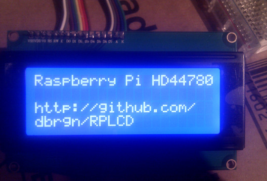

Usage
#####

Make sure to read the :ref:`getting-started` section if you haven't done so yet.

Writing To Display
==================

Regular text can be written to the :class:`~RPLCD.i2c.CharLCD` instance using
the :meth:`~RPLCD.i2c.CharLCD.write_string` method. It accepts unicode strings
(``str`` in Python 3).

The cursor position can be set by assigning a ``(row, col)`` tuple to
:attr:`~RPLCD.i2c.CharLCD.cursor_pos`. It can be reset to the starting position
with :meth:`~RPLCD.i2c.CharLCD.home`.

Line feed characters (``\n``) move down one line and carriage returns (``\r``)
move to the beginning of the current line.

.. sourcecode:: python

    lcd.write_string('Raspberry Pi HD44780')
    lcd.cursor_pos = (2, 0)
    lcd.write_string('https://github.com/\n\rdbrgn/RPLCD')

You can also use the convenience functions ``cr()``, ``lf()`` and ``crlf()`` to
write line feed (``\n``) or carriage return (``\r``) characters to the display.

.. sourcecode:: python

    lcd.write_string('Hello')
    lcd.crlf()
    lcd.write_string('world!')

After your script has finished, you may want to close the connection and
optionally clear the screen with the :meth:`~RPLCD.gpio.CharLCD.close` method.

.. sourcecode:: python

    lcd.close(clear=True)

When using a GPIO based LCD, this will reset the GPIO configuration. Note that
doing this without clearing can lead to undesired effects on the LCD, because
the GPIO pins are floating (not configured as input or output anymore).

Clearing the Display
====================

You can clear the display by using the :meth:`~RPLCD.i2c.CharLCD.clear` method. It
will overwrite the data with blank characters and reset the cursor position.

Alternatively, if you want to hide all characters but keep the data in the LCD
memory, set the :attr:`~RPLCD.i2c.CharLCD.display_enabled` property to ``False``.

Character Maps
==============

RPLCD supports the two most commonly used character maps for HD44780 style
displays: A00 and A02. You can find them on pages 17 and 18 of `the datasheet
<https://www.sparkfun.com/datasheets/LCD/HD44780.pdf>`_.

Additionally it supports the character map 0B of the ST7066 controller chip.

The default character map is ``A02``. If you find that some of the characters
you are writing to the display turn out wrong, then try using the ``A00``
character map:

.. sourcecode:: python

    lcd = CharLCD(..., charmap='A00')

As a rule of thumb, if your display can show Japanese characters, it uses
``A00``, otherwise ``A02`` or ``ST0B``. To show the entire character map on your LCD, you
can use the ``show_charmap`` target of the ``rplcd-tests`` script.

Should you run into the situation that your character map does not seem to match
either the ``A00`` or the ``A02`` tables, please `open an issue
<https://github.com/dbrgn/RPLCD/issues>`_ on Github.

The same thing counts if you have a character that should be supported by your
character map, but which doesn't get written correctly to the display. Let me
know by `opening an issue <https://github.com/dbrgn/RPLCD/issues>`_!

In case you need a character that is not included in the default device
character map, there is a possibility to create custom characters and write them
into the HD44780 CGRAM. For more information, see the :ref:`custom-characters`
section.

.. _custom-characters:

Creating Custom Characters
==========================

The HD44780 supports up to 8 user created characters. A character is defined by
a 8x5 bitmap. The bitmap should be a tuple of 8 numbers, each representing a 5
pixel row. Each character is written to a specific location in CGRAM (numbers
0-7).

.. sourcecode:: python

    >>> lcd = CharLCD(...)
    >>> smiley = (
    ...     0b00000,
    ...     0b01010,
    ...     0b01010,
    ...     0b00000,
    ...     0b10001,
    ...     0b10001,
    ...     0b01110,
    ...     0b00000,
    ... )
    >>> lcd.create_char(0, smiley)

To actually show a stored character on the display, you can use hex escape codes
with the location number you specified previously. For example, to write the
character at location 3:

.. sourcecode:: python

    >>> lcd.write_string('\x03')

The escape code can also be embedded in a longer string:

.. sourcecode:: python

    >>> lcd.write_string('Hello there \x03')

The following tool can help you to create your custom characters:
https://omerk.github.io/lcdchargen/

Changing the Cursor Appearance
==============================

The cursor appearance can be changed by setting the
:attr:`~RPLCD.i2c.CharLCD.cursor_mode` property to one of the following three
values:

- ``hide`` – No cursor will be displayed
- ``line`` – The cursor will be indicated with an underline
- ``blink`` – The cursor will be indicated with a blinking square

Backlight Control
=================

I²C
~~~

If you're using an LCD connected through the I²C bus, you can directly turn on
the backlight using the boolean :attr:`~RPLCD.i2c.CharLCD.backlight_enabled` property.

GPIO
~~~~

By setting the ``pin_backlight`` parameter in the :class:`~RPLCD.gpio.CharLCD`
constructor, you can control a backlight circuit.

First of all, you need to build an external circuit to control the backlight,
most LCD modules don't support it directly. You could do this for example by
using a transistor and a pull-up resistor. Then connect the transistor to a GPIO
pin and configure that pin using the ``pin_backlight`` parameter in the
constructor. If you use an active high circuit instead of active low, you can
change that behavior by setting the  ``backlight_mode`` to either
``active_high`` or ``active_low``. Now you can toggle the
:attr:`~RPLCD.gpio.CharLCD.backlight_enabled` property to turn the backlight on
and off.

pigpio
~~~~~~

When using the ``pigpio`` library, it is also possible to control the backlight
with PWM.

The API is compatible to the backlight control of I²C and GPIO explained above,
but the :attr:`~RPLCD.pigpio.CharLCD.backlight_enabled` property (and parameter)
now also accepts a value between ``0`` and ``1`` as a backlight level (``0`` or
``False`` turns the backlight off, ``1`` or ``True`` turns it on). The perceived
brightness of the backlight should roughly correspond to the given value.

The PWM dimming of the backlight has to be enabled explicitly by setting the
``backlight_pwm`` parameter to ``True`` during initialization of
:class:`~RPLCD.pigpio.CharLCD`. If this parameter is ``False`` (the default
value), the interface only switches the backlight on and off. If this parameter
is a number, dimming of the backlight is enabled and the value is interpreted
as the PWM frequency in Hertz.

Contrast Control
================

This is currently only possible with the pigpio backend.

pigpio
~~~~~~

The API is similar to that controlling the backlight. The ``pin_contrast``
specifies the pin connected to the LCDs contrast input. The ``contrast_mode``
can be ``active_high`` or ``active_low`` and the ``contrast_pwm`` sets the PWM
frequency.

The :attr:`~RPLCD.pigpio.CharLCD.contrast` property sets the contrast level. It
should be a value between ``0`` and ``1``. It is also recognized as a parameter
to :class:`~RPLCD.pigpio.CharLCD` to set the initial contrast level.

If you don't set the ``pin_contrast`` parameter, the contrast control stays
disabled.

Automatic Line Breaks
=====================

By default, RPLCD tries to automatically insert line breaks where appropriate
to achieve (hopefully) intuitive line wrapping.

Part of these rules is that manual linebreaks (either ``\r\n`` or ``\n\r``) that
immediately follow an automatically issued line break are ignored.

If you want more control over line breaks, you can disable the automatic system
by setting the ``auto_linebreaks`` parameter of the ``CharLCD`` constructor to
``False``.

.. sourcecode:: python

    lcd = CharLCD(..., auto_linebreaks=False)

Scrolling Text
==============

I wrote a blogpost on how to implement scrolling text:
https://blog.dbrgn.ch/2014/4/20/scrolling-text-with-rplcd/

To see the result, go to https://www.youtube.com/watch?v=49RkQeiVTGU.

Raw Commands
============

You can send raw commands to the LCD with :meth:`~RPLCD.i2c.CharLCD.command` and
write a raw byte to the LCD with :meth:`~RPLCD.i2c.CharLCD.write`. For more
information, please refer to the Hitachi HD44780 datasheet.
